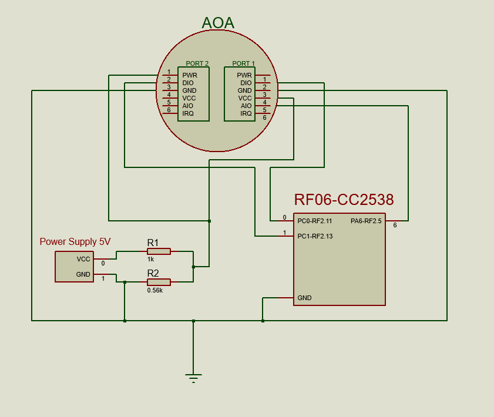

SmartRF06-CC2538
================


Pre-requisities
---------------

- [Code Composer Studio](http://www.ti.com/tool/ccstudio)
- [RF06 CC2538 board](http://www.ti.com/tool/cc2538dk)
- AOA Sensor
- 2 Resistors (1000 Ohm and 560 Ohm)
- 1 LED
- Wires
- 1 External Power Supply

Build and Install
=================
Clone and import project in CCS. Connect RF06 with AOA sensor as shown in the picture.



All necessary documentation is in: [Documentation](https://github.com/ijuresa/SmartRF06-CC2538/tree/master/Documentation)

Usage
=================
AOA sensor consists of two ports: 
 - PORT1 is receiving side and it is on bottom of the sensor. It has 12 phototransistors on it.
 - PORT2 is sending side and it is on top of the sensor. It has 12 photodiodes on it.
Comparatively AOA communicates with RF06-CC2538 with:
 - PORT1: one digital, select channel from multiplexer, and one analog, read ADC value, pin.
 - PORT2: one digital, turn ON or OFF photodiodes, pin

Unfortunately, RF06-CC2538 doesn't have output VCC pin so AOA sensor, or any outside sensor, must be fed with external power. AOA is working on 3.3 - 4.2 V but it can survive on 5V :).

RF06-CC2538 has serial interface (UART) wired so for simple debugging purposes it doesn't have to be connected with USB to TTL serial cable. It is initialized in [main.c](https://github.com/ijuresa/SmartRF06-CC2538/blob/master/App/main.c#L90).

#### Important notice
In original driver AOA PORT1 and PORT2 are mashed together in one driver. Here on the other hand, you cannot control PORT2 with AOA driver. For that is created [LED driver](https://github.com/ijuresa/SmartRF06-CC2538/blob/master/Libraries/led_state.c)

#### Important notice
Delay in this driver is drawn out from AOA driver and it depends on SYS Clock (System Clock) which is set to 32MHz. It you change clock speed, [delay timer](https://github.com/ijuresa/SmartRF06-CC2538/blob/master/Utilities/delay.c) must be changed accordingly. 

### Example usage
See [main.c](https://github.com/ijuresa/SmartRF06-CC2538/blob/master/App/main.c)

Porting to another MCU
======================
In AOA driver there are four function which need to be changed. 
``` C
    static void digitalWrite(uint8_t portNumber, uint8_t value,
                             RF06_error_E *err);
    static void setGpioModeInput(uint8_t gpioPin, uint32_t gpioPort,
                                 RF06_error_E *err);
    static void AOA_adcRead(uint8_t i, uint8_t *outputArray);

    static void INIT_Gpio();
```

On the other hand if you want to use another pins for AOA all you need to do is change #define, ## Do not touch AOA driver if this is the case
