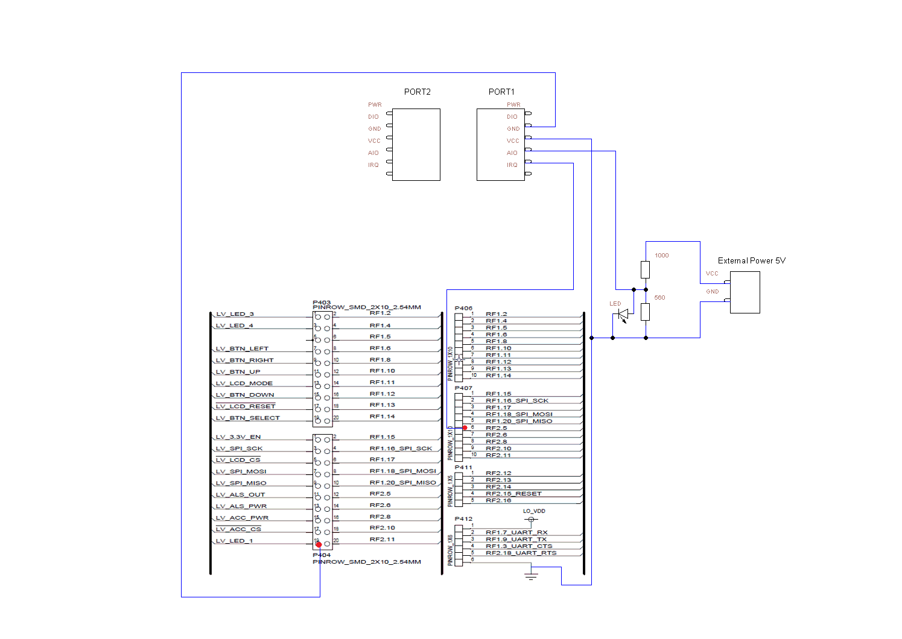

SmartRF06-CC2538
================

Pre-requisities
---------------

- Code Composer Studio
- [RF06 CC2538 board](http://www.ti.com/tool/cc2538dk)
- AOA Sensor
- 2 Resistors (1000 Ohm and 560 Ohm)
- 1 LED
- Wires
- 1 External Power Supply

Build and Install
=================

Clone and import project in CCS.

